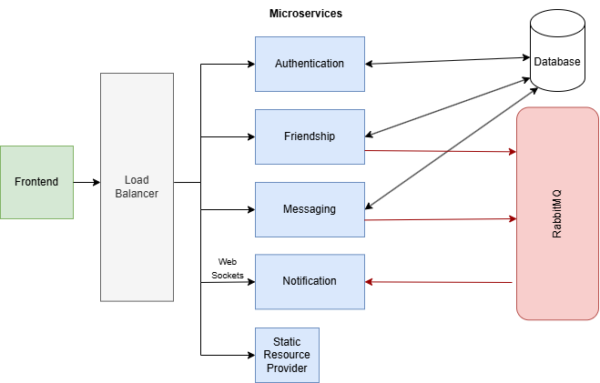

# Proposal

## From a Monolith to Microservices & Microservice Communication Observation with OpenTelemetry & Jaeger

### Project Definition

This project should transform a monolithic messaging application into a microservices-based architecture. The system will use WebSockets for real-time updates, a message broker (RabbitMQ) for communication between microservices and OpenTelemetry with Jaeger for monitoring.

**Microservices:**

-    **Authentication Service**: Handles user login, registration, and JWT-based authentication
-    **Friendship Management Service**: Manages friend requests, relationships, and notifications
-    **Messaging Service**: Handles text messaging functionalities, including sending, storing, and retrieving messages
-    **Notification Service**: Subscribes to the message broker for event updates and sends notifications to WebSocket-connected clients in real-time
-    **Static Resource Provider**: Provides HTML, CSS, js and images

### Implementation

#### Milestones

**Service Design and Setup**

-    Define APIs for each service
-    Set up Docker for containerized development
-    Design WebSocket manager for real-time updates

**Build Core Microservices**

-    Implement core functionalities for Authentication, Friendship Management, and Messaging Services
-    Develop WebSocket communication in the Notification Service

**Deploy in Google Cloud**

### Responsibilities

**David Weinstabl: Authentication and Deployment**

-    Design and implement the Authentication Service and Static Resource Provider
-    Design and implement Notification Service
-    Integrate OpenTelemetry instrumentation for this service

**Sarah Dreiblmeier: Friendship Management and Observability**

-    Design and implement the Friendship Management Service
-    Set up Jaeger for trace visualization
-    Integrate OpenTelemetry instrumentation for this service

**Paula Schachinger: Messaging, WebSockets, and Notifications**

-    Design and implement the Messaging Service
-    Integrate OpenTelemetry instrumentation for this service

## Concept

